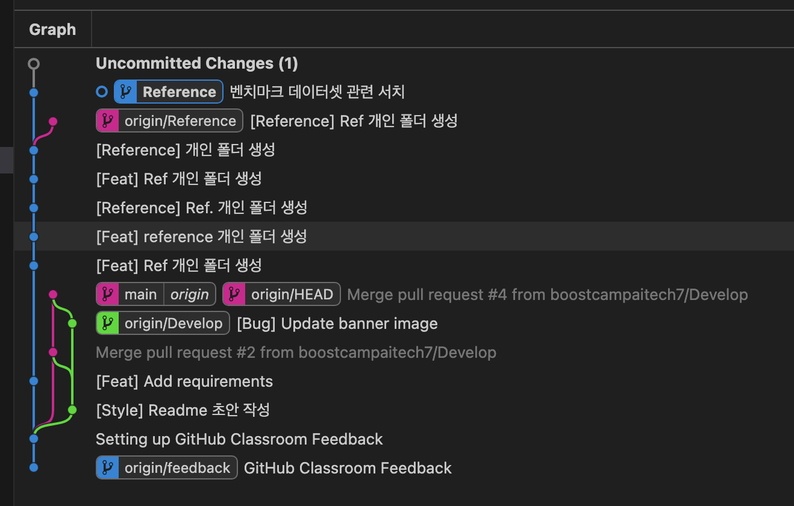
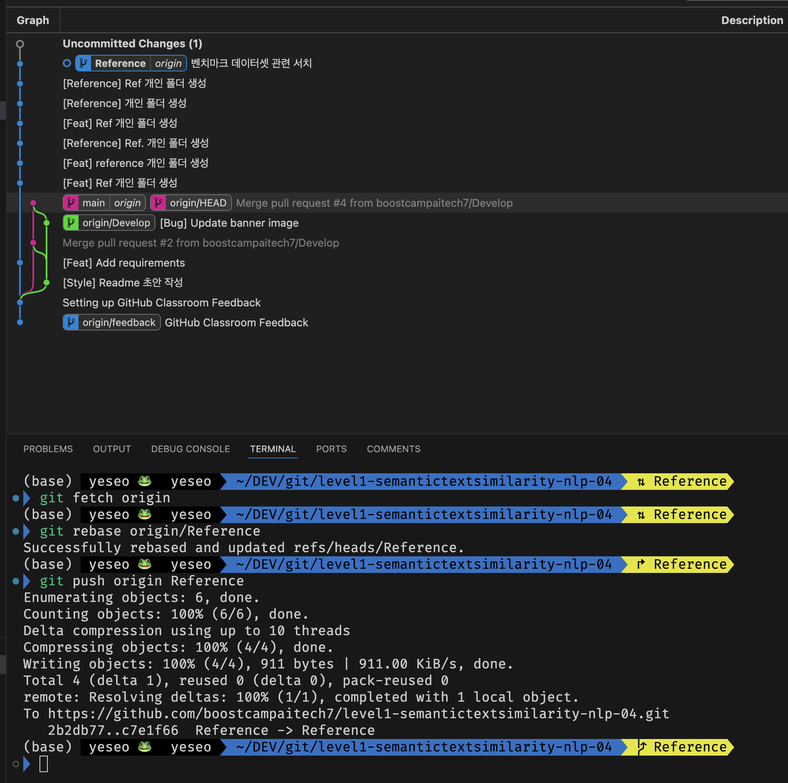

 ## 1. Local Branch에서 작업 도중 팀원이 Remote branch에 push한 변경사항을 반영하고 싶을 때

- 현재 상황에서 원격 브랜치(origin/Reference)에 새로운 커밋이 있는 것을 확인했고, 로컬 브랜치에서 작업한 커밋을 원격 브랜치에 푸시하려면 원격 브랜치의 최신 상태로 로컬 브랜치를 업데이트 해야한다. 코드는 다음과 같다.  

```bash
git fetch origin
git rebase origin/Reference
git push origin Reference
```

- `merge origin/Reference`로 업데이트 할 수도 있으나 이 때는 불필요한 merge commit이 남게된다. (필요에 따라 기록할 수도 있다.)  


- 로컬 브랜치를 원격 브랜치의 최신 상태로 업데이트 했기 때문에 정상적으로 push할 수 있다. 이는 팀원들이 각각의 Feature Branch와 하나의 Develop Branch로 작업하는 상황에도 똑같이 적용된다.   

- `git pull --rebase`를 활용해도 된다.  
    (참고: [git pull --rebase로 최신 변경된 커밋을 받아오기](https://hanaindec.tistory.com/entry/git-%EB%B3%80%EA%B2%BD%EC%82%AC%ED%95%AD%EC%9D%84-pull-%EB%B0%9B%EC%95%84%EC%98%A4%EA%B8%B0-pull-rebase))  

  

